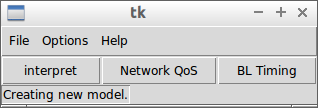
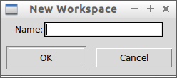
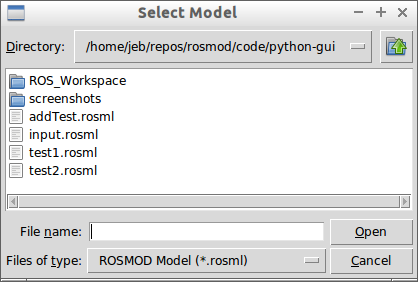
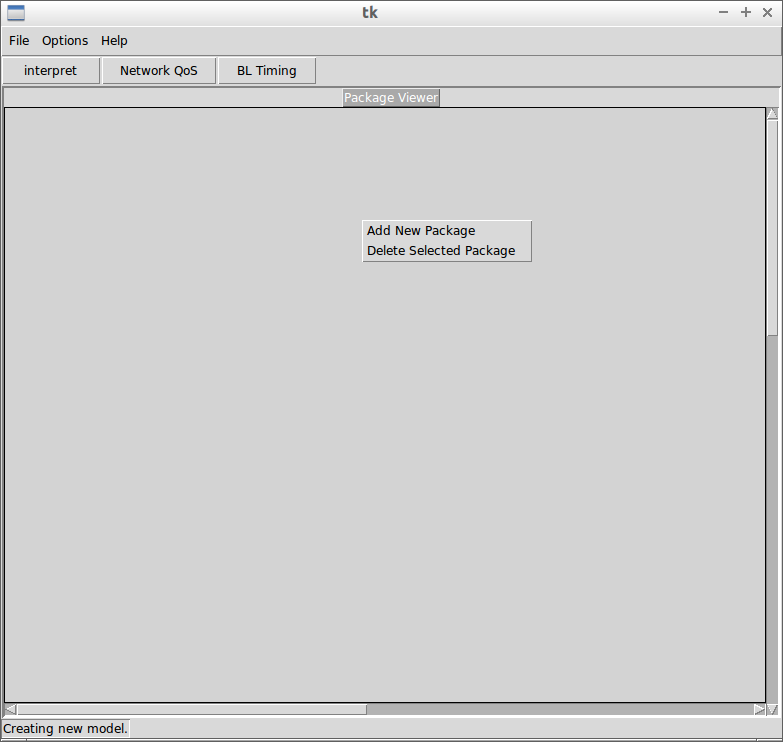
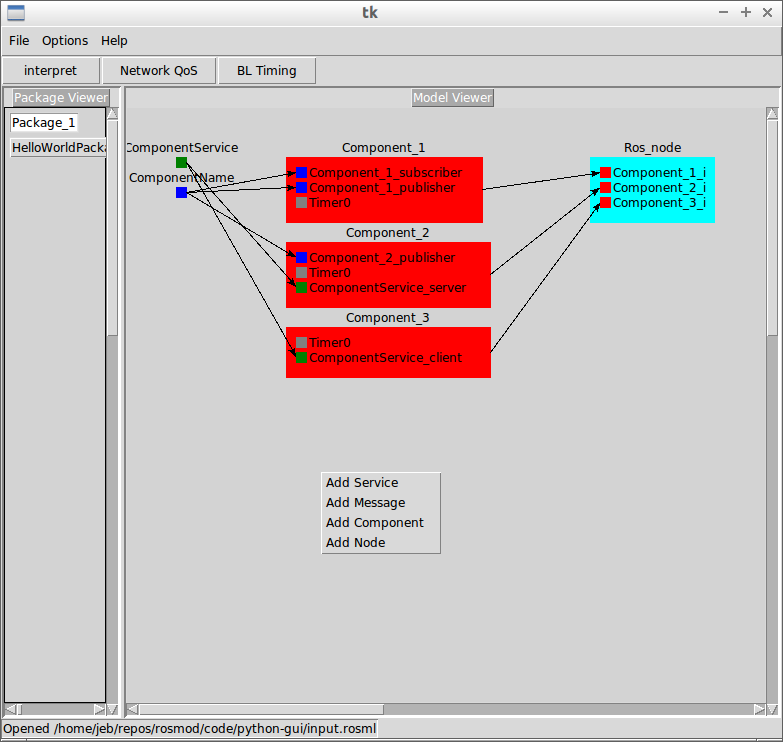
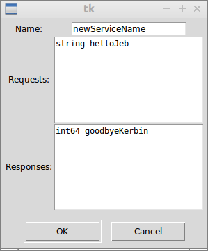

# ROSML Editor GUI
=======================
This codebase controls the graphical editor for *.rosml files.  It allows for the creation, alteration, and deletion of elements within a ROSML model such as 

  1. The workspace
  2. packages
  3. messages
  4. services
  5. component definitions
  6. component timers
  7. component message subscribers
  8. component message publishers
  9. component service providers (servers)
  10. component service users (clients)
  11. nodes
  12. node component instances

Furthermore, the editor allows for the interpretation and analysis of the ROSML model.  Interpretation of the model involves generating component based skeleton code following the design of the model.  Analysis of the model entails either analyzing the model's network quality of service characteristics or analyzing the business logic model's timing and scheduling characteristics.  

## Using the Editor
-------------------
This section describes how to use the ROSML editor to create, open, edit, save, and interpret a ROSML model file.  Most of the user interface for the editor is based around right-click context menus which provide the relevant actions according to the given context.  When the editor is started, the main editor pane does not exist, as no model has been initialized yet.  

The main operations covered in these subsections are

  * [Creating a New Model](#creating-a-model)
  * [Opening an Existing Model](#open-an-existing-model)
  * [Editing a Model](#editing-a-model)
  * [Saving a Model](#saving-a-model)
  * [Generating Code for a Model](#generating-code-for-a-model)

Note: to initialize a model, you must either [Create a new model](#creating-a-model) or [Open an existing model](#open-an-existing-model).

### Creating a Model
--------------------
To create a new model, navigate to the _File_ menu and click on _New Model_.  

Upon doing this, a popup window will appear asking you to name the toplevel workspace for this model.  The workspace is what contains all packages in the model.  

### Opening an Existing Model
-----------------------------
To open an existing model, navigate to the _File_ menu and click on _Open Model_. An open file dialog will popup which will allow you to navigate to the proper folder and file which you want to open.  

### Editing a Model
-------------------
An opened or newly created model presents you with the _Package Viewer_, which displays all packages that currently exist in the model.  

#### Creating and Removing Packages
-----------------------------------
If you right click inside the _Package Viewer_, you'll be presented with a context menu which allows you to either add a new package or delete the selected package.  

Any packages that exist in the workspace will be displayed as buttons in the _Package Viewer_.  The user may view the model contained within a package by clicking on the package's button, at which point the button will remain highlighted until another package is selected.  When this happens, the package viewer shrinks to allow for the viewing of the _Model Viewer_.  The _Model Viewer_ shows all objects currently contained within the model, including _services_, _messages_, _component definitions_, and _nodes_ and shows the logical connection between the objects, if any exists.  

Right clicking inside the _Model Viewer_ pane brings up the model context menu, which allows for the creation of _messages_, _services_, _components_, and _nodes_.

#### Adding Services and Messages
---------------------------------
Selecting _Add Service_ or _Add Message_ from the model context menu creates dialog windows which allow you to specify the name of the message or service, as well as the fields or the requests and responses, respectively.  

#### Adding Components
----------------------

##### Adding Objects to Components
----------------------------------

#### Adding Nodes
-----------------

### Saving a Model
------------------
Saving a model in the editor means translating it back into the ROSML file format.  Please note that currently if you have comments in a ROSML model file and choose to overwrite it using the editor, the comments will be lost.  

Saving a model (either through _Save Model_ or _Save Model As_) writes the model to the disk.  If you have created a new model and have not saved it, either option will require you to choose a filename with a dialog.  If you have opened a model or have already saved your new model, then only _Save As_ will prompt you for a filename with a dialog.  

### Generating code for a Model
-------------------------------
To generate the component code based on the model, you simply press the _Interpret_ toolbar button.  This will prompt you for a location in which to generate the code.  The generated code and build system will be placed into a folder created there called _ROS\_Workspace_.  

